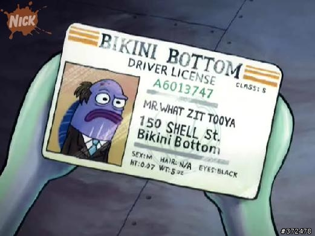
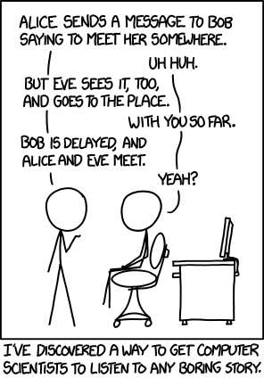
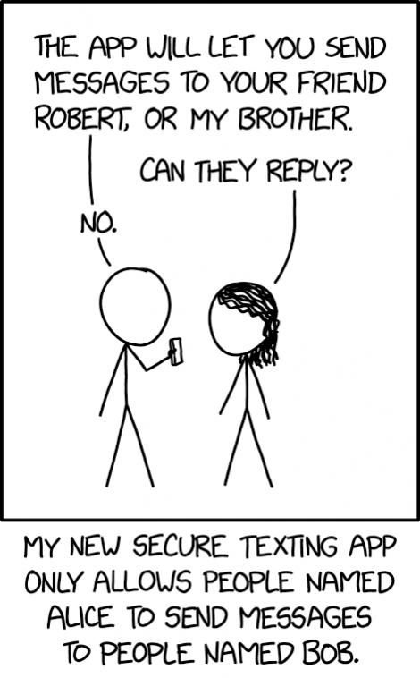

<!-- _class: lead terminal-accent -->
# Identification Schemes `&` Entity Authentication

- BD
- SP
- TJ

---

# Table of Contents

1. Identification Schemes
    - What is Identification
    - How do you Identify?
1. Private Key Identification
1. Mutual Authentication
1. References

---

# Identification Schemes

- confirm the identity of something/someone


> how do you **correctly** identify people in this dark room?

---

## How do you **correctly** identify someone or something???



You could do it in one of three ways. You look at 
- What they **are**
- What they **have**
- What they **know**

---


## Recognition IS NOT Authentication

<div class="box">

| **Recognition**                 | **Authentication**                      |
| ------------------------------- | -----------------------------------------|
| "i think i recognise your face"| "show me your id"                       |
| "hey do you remember when...?" | "lets do a biometric scan"              |
| "oh you know this person too?" | "oh you have a photo with this person!" |

> how do you **correctly and securely** identify someone?

</div>

<!-- slightly redundant slide but caitvi -->

---

## Identify Yourself Over Insecure Channels

- you **can not** tell someone what you know over an insecure channel
  - this exposes private information and now everyone else knows it too
  - so you want a **zero-knowledge** proof of identification
- you need to incorporate *randomness* to prevent **replay attacks**
> We need identification schemes or protocols that *do not* allow someone (Oscar) listening to Alice and Bob to misrepresent themselves as either of them

---


## Challenge and Response

the simplest way to check if the other person "has" something is to ask them 

  1. Bob **"challenges"** Alice
  1. Alice must provide a valid **"response"** to be authenticated

---



# Private Key Identification

We begin by considering the *secret-key* setting where Alice and Bob both have the same secret-key $K$

---

## Protocol 1: Insecure Challenge-And-Response

1. Bob chooses a random *challenge* $r$, which he sends to Alice
2. Alice computes $y = MAC_K(r)$ and sends $y$ to Bob
3. Bob computes $y' = MAC_K(r)$ and if $y' = y$, Bob "accepts"

**Flow Diagram:**
```
        Alice                                Bob
1.                  <-------- r --------  
2.      y = MAC(r)  --------─ y -------->
3.                                          y = MAC(r)?
```

---

> What if you ask Bob to verify his identify against the same random challenge $r$?

---

### Attacking Protocol 1: Parallel Session Attacks

###### Session 1
```
        Oscar                                Bob
1.                  <-------- r --------  
```


###### Session 2
```
        Bob                                  Oscar
1.                  <-------- r --------  
2.      y = MAC(r)  --------─ y -------->    scheme broken
```


###### Session 1
```
        Oscar                                Bob
2.      y           --------─ y -------->    accept
```

---

### Attacking Protocol 1: Parallel Session Attacks

```
Session 1:   Oscar <---r--- Bob
               ↓
            +-----+
            │  r  | (same challenge)
            +-----+
               ↓
Session 2:   Oscar ----r---> Bob  
                           |
               +------y----+
               ↓
            +-----+
            │  y  | (Bob's MAC)
            +-----+
               ↓
Session 1:   Oscar ----r---> Bob (ACCEPT)
```


---

> More than just a secure $MAC$ algorithm is required

---

## Protocol 2: (Secure) Identity-Bound Challenge and Response

1. Bob chooses a random *challenge* $r$, which he sends to Alice
2. Alice computes $y = MAC_K(ID(Alice) || r)$ and sends $y$ to Bob
3. Bob computes $y' = MAC_K(ID(Alice) || r)$ and if $y' = y$, Bob "accepts"

**Flow Diagram:**
```
    Alice                                            Bob
1.                          <-------- r --------  
2.  y = MAC(id(alice)||r)   --------─ y -------->
3.                                                  y = MAC(id(alice)||r)?
```

---

> No longer weak to parallel session attacks! But is it secure against other attacks?

---

### Proving Security of Protocol 2

##### Assumptions:
1. **secret key**: $K$ is known only to Alice and Bob
1. **random challenges**: $r$'s are perfectly random and of $k$ bits
1. **MAC security**: Assume the MAC is secure, i.e.

there does NOT exist a $(\varepsilon, Q)$ forger for the MAC, where
- $\varepsilon$ is the maximum probability that Oscar can compute $MAC_K(x)$
- even when given $Q$ **known message** codes $(x_i, MAC_K(x_i))$ for $i \le Q$

---

##### Proof Idea:

There are only 3 cases where $y$ was computed before being used in this session
- by Alice in a previous session. But $r$ is random and this would mean it was reused
- by Oscar without knowing what $K$ is, this will have a very small probability of being correct
- by Bob in a previous session: but Bob will only compute $MAC_K(ID(Bob)||r)$ so he can't have computed $y$, so we will ignore this case

---

##### Proof:

1. $y$ previously computed by Alice
- $r$ was reused from one of the previous $Q$ sessions, the probability of this happening is 
$$
\Pr[r_{curr} = r_{prev}] = \frac{Q}{2^k}
$$

---

##### Proof:
2. $y$ has been forged by Oscar
- the MAC is $(\varepsilon, Q)$ secure
- thus the probability of a successful forgery is 
$$
\Pr[forgery] = \varepsilon
$$

---

Thus we can conclude

> if $MAC$ is an $(\varepsilon, Q)$ secure message authentication code, and suppose random challenges are $k$ bits in length. Then Protocol 2 is a $(\varepsilon + \frac{Q}{2^k}, Q)$ secure identification scheme

---

### Attacking Protocol 2: Intruder-in-the-middle

```
          Alice                                     Oscar                                  Bob
1.                            <---------r-------             <-----------r----------       
2. y = MAC(ID(alice)||r)      ----------y------->            ------------y---------->      
3.                                                                                         accept
```

- However in this scenario Oscar is *passive* and we do not consider this interaction to be insecure.
- If Oscar was considered to be *active*, he would
  - carry out an *information-gathering* phase
  - then try to exploit this information and deceive Alice/Bob
- This attack model would still have the same security analysis

---



# Mutual Authentication

When opening a new channel of communication, both Alice and Bob must authenticate themselves to each other.

---

### Protocol 3: (Insecure) Mutual Challenge-And-Response

1. Bob chooses a random challenge, $r_1$, which he sends to Alice.  
2. Alice chooses a random challenge, $r_2$.  
   Alice computes $y_1 = MAC_K(ID(Alice) ‖ r_1)$ and sends $(y_1, r_2)$ to Bob.  
3. Bob computes $y'_1 = MAC_K(ID(Alice) ‖ r_1)$. If $y'_1 = y_1$, Bob *accepts*; otherwise *rejects*.  
   Bob computes $y_2 = MAC_K(ID(Bob) ‖ r_2)$ and sends $y_2$ to Alice.  
4. Alice computes $y'_2 = MAC_K(ID(Bob) ‖ r_2)$. If $y'_2 = y_2$, Alice *accepts*; otherwise *rejects*.
---
**Flow Diagram:**
```
      Alice                                                Bob
1.                          <----------- r1 -----------
2. y1=MAC(id(A)||r1)        ---------- r2, y1 -------->
3.                                                         y1 valid? (accepts Alice)
4.                          <----------- y2 -----------    y2=MAC(id(B)||r2)
5. y2 valid? (accepts Bob)  
```
---

> What if Oscar impersonates as Alice to Bob and as Bob to Alice?

---

#### Attacking Protocol 3: Reflection Attacks

Oscar can impersonate Bob to Alice by using Bob himself as an oracle to compute the required response.

###### Session 1 (Oscar (as Bob) initiates with Alice)
```
Alice <---- r1 ------ Oscar(Bob)
Alice --- r2, y1 ---> Oscar(Bob)
```

###### Session 2 (Oscar (as Alice) reflects the challenge to Bob)
```
Oscar(Alice) --- r2 ---> Bob (as his own challenge)
Oscar(Alice) <--- y2 --- Bob (Bob computes the response)
```

###### Session 1 (Oscar completes the impersonation)
```
Alice <--- y2 --- Oscar(Bob) (ACCEPT)
```

---

## Protocol 4: (Secure) Mutual Challenge-And-Response

1. Bob chooses a random challenge $r_1$, which he sends to Alice.  
2. Alice chooses a random challenge $r_2$.  
   Alice computes $y_1 = MAC_K(ID(Alice) ‖ r_1 ‖ r_2)$ and sends $(y_1, r_2)$ to Bob.  
3. Bob computes $y′_1 = MAC_K(ID(Alice) ‖ r_1 ‖ r_2)$.  
   If $y′_1 = y_1$, Bob *accepts*; otherwise *rejects*.  
   Bob computes $y_2 = MAC_K(ID(Bob) ‖ r_2)$ and sends $y_2$ to Alice.  
4. Alice computes $y′_2 = MAC_K(ID(Bob) ‖ r_2)$.  
   If $y′_2 = y_2$, Alice *accepts*; otherwise *rejects*.
---

**Flow diagram:**
```
      Alice                                                 Bob
1.                            <----------- r1 -----------
2. y1=MAC(id(A)||r1||r2)       ---------- r2, y1 ------->
3.                                                         y1 valid? (accepts Alice)
4.                            <----------- y2 -----------  y2=MAC(id(B)||r2)
5. y2 valid? (accepts Bob)
```

---

### Proving Security of Protocol 4

##### Assumptions:
1. **secret key**: $K$ is known only to Alice and Bob
1. **random challenges**: $r$'s are perfectly random and of $k$ bits
1. **MAC security**: Assume the MAC is secure, i.e.

there does NOT exist a $(\varepsilon, Q)$ forger for the MAC, where
- $\varepsilon$ is the maximum probability that Oscar can compute $MAC_K(x)$
- even when given $Q$ **known message** codes $(x_i, MAC_K(x_i))$ for $i \le Q$

---
##### Proof Idea:

There are only 3 cases where a valid tag (y₁ or y₂) could have been computed before being used in the current session:
- By Alice or Bob in a previous session:
  - This would require the same pair of random challenges (r₁, r₂) to be reused.Since both challenges are fresh and uniformly random, the probability of this happening is extremely small.
- By Oscar without knowing what $K$ is, this will have a very small probability of being correct
- By the honest partner in this session:
This is expected behaviour, Alice and Bob compute and verify their own tags, so this case is ignored.

---

> Given a $(\varepsilon, Q)$ secure MAC algorithm, protocol 4 is a $(\frac{Q}{2^k} + 2\varepsilon, \frac{Q}{2})$ secure mutual identification scheme

---

# Referencces

- [Cryptography Academy](https://cryptographyacademy.com/identification-schemes/)
- [Challenge-Response Authentication](https://en.wikipedia.org/wiki/Challenge%E2%80%93response_authentication)
- [Parallel Session Attacks](https://link.springer.com/content/pdf/10.1007/978-3-540-85257-5_24.pdf?pdf=inline+link)
- [Authentication in SSH](https://web.archive.org/web/20041014002830/http://www.cag.lcs.mit.edu/~rugina/ssh-procedures/)

---

# Thank You
