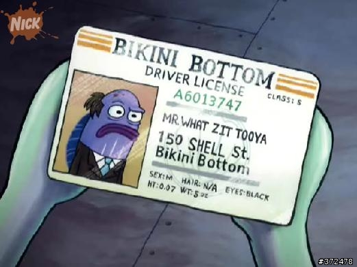
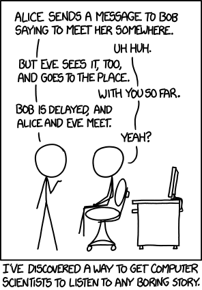

<!-- _class: lead terminal-accent -->
# Identification Schemes `&` Entity Authentication

- Bala Dharnesh  
- Sai Pragnaan  
- Tegan Jain

---

# Table of Contents

1. Identification Schemes
    - What is Identification
    - How do you Identify?
1. Private Key Identification
1. Mutual Authentication
1. Public Key Identification
1. Attack Models and Examples
1. References

---

# Identification Schemes

- confirm the identity of something/someone


> how do you **correctly** identify people in this dark room?

---

## How do you **correctly** identify someone or something???



You could do it in one of three ways. You look at 
- What they **are**
- What they **have**
- What they **know**

---


## Recognition IS NOT Authentication

<div class="box">

| **Recognition**                 | **Authentication**                      |
| ------------------------------- | -----------------------------------------|
| "i think i recognise your face"| "show me your id"                       |
| "hey do you remember when...?" | "lets do a biometric scan"              |
| "oh you know this person too?" | "oh you have a photo with this person!" |

> how do you **correctly and securely** identify someone?

</div>

<!-- slightly redundant slide but caitvi -->

---

## Identify Yourself Over Insecure Channels

- you **can not** tell someone what you know over an insecure channel
  - this exposes private information and now everyone else knows it too
  - so you want a **zero-knowledge** proof of identification
- you need to incorporate *randomness* to prevent **replay attacks**
> We need identification schemes or protocols that *do not* allow someone (Oscar) listening to Alice and Bob to misrepresent themselves as either of them

---


## Challenge and Response

the simplest way to check if the other person "has" something is to ask them 

  1. Bob **"challenges"** Alice
  1. Alice must provide a valid **"response"** to be authenticated

---



# Private Key Identification

We begin by considering the *secret-key* setting where Alice and Bob both have the same secret-key $K$

---

## Protocol 1: Insecure Challenge-And-Response

1. Bob chooses a random *challenge* $r$, which he sends to Alice
2. Alice computes $y = MAC_K(r)$ and sends $y$ to Bob
3. Bob computes $y' = MAC_K(r)$ and if $y' = y$, Bob "accepts"

**Flow Diagram:**
```
        Alice                                Bob
1.                  <-------- r --------  
2.      y = MAC(r)  --------─ y -------->
3.                                          y = MAC(r)?
```

---

> What if you ask Bob to verify his identify against the same random challenge $r$?

---

### Attacking Protocol 1: Parallel Session Attacks

###### Session 1
```
        Oscar                                Bob
1.                  <-------- r --------  
```


###### Session 2
```
        Bob                                  Oscar
1.                  <-------- r --------  
2.      y = MAC(r)  --------─ y -------->    scheme broken
```


###### Session 1
```
        Oscar                                Bob
2.      y           --------─ y -------->    accept
```

---

### Attacking Protocol 1: Parallel Session Attacks

```
Session 1:   Oscar <---r--- Bob
               ↓
            +-----+
            │  r  | (same challenge)
            +-----+
               ↓
Session 2:   Oscar ----r---> Bob  
                           |
               +------y----+
               ↓
            +-----+
            │  y  | (Bob's MAC)
            +-----+
               ↓
Session 1:   Oscar ----r---> Bob (ACCEPT)
```


---

> More than just a secure $MAC$ algorithm is required

---

## Protocol 2: (Secure) Identity-Bound Challenge and Response

1. Bob chooses a random *challenge* $r$, which he sends to Alice
2. Alice computes $y = MAC_K(ID(Alice) || r)$ and sends $y$ to Bob
3. Bob computes $y' = MAC_K(ID(Alice) || r)$ and if $y' = y$, Bob "accepts"

**Flow Diagram:**
```
    Alice                                            Bob
1.                          <-------- r --------  
2.  y = MAC(id(alice)||r)   --------─ y -------->
3.                                                  y = MAC(id(alice)||r)?
```

---

> No longer weak to parallel session attacks! But is it secure against other attacks?

---

### Proving Security of Protocol 2

##### Assumptions:
1. **secret key**: $K$ is known only to Alice and Bob
1. **random challenges**: $r$'s are perfectly random
1. **MAC security**: Assume the MAC is secure, i.e.

there does NOT exist a $(\varepsilon, Q)$ forger for the MAC, where
- $\varepsilon$ is the maximum probability that Oscar can compute $MAC_K(x)$
- even when given $Q$ **known message** codes $(x_i, MAC_K(x_i))$ for $i \le Q$

---

##### Proof Idea:


---


# Referencces

- [Cryptography Academy](https://cryptographyacademy.com/identification-schemes/)
- [Challenge-Response Authentication](https://en.wikipedia.org/wiki/Challenge%E2%80%93response_authentication)
- [Parallel Session Attacks](https://link.springer.com/content/pdf/10.1007/978-3-540-85257-5_24.pdf?pdf=inline+link)
- [Authentication in SSH](https://web.archive.org/web/20041014002830/http://www.cag.lcs.mit.edu/~rugina/ssh-procedures/)

---

# Thank You
